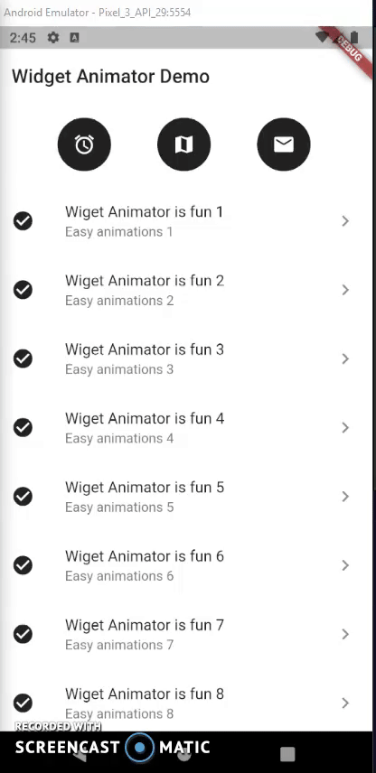

# Widget Animator
[](https://travis-ci.org/antonvinceguinto/widget-animator)
[]()

This package helps you to easily animate your widgets with just a few steps.

This works well on your ListView items and... actually all of your widgets!

# Demo



# Using

```dart
 return Scaffold(
      backgroundColor: Colors.white,
      body: ListView.builder(
        itemCount: 32,
        itemBuilder: (context, index) {
            return WidgetAnimator(
              curve: Curves.easeIn, // Optional, choose the type of animation curve you want!
              duration: Duration(milliseconds: 120), // Optional, defaults to 290ms
              child: ListTile(
                title: Text('Item $index'),
              ),
            );
        },
      ),
    );
```

Check me out: https://antonguinto.com